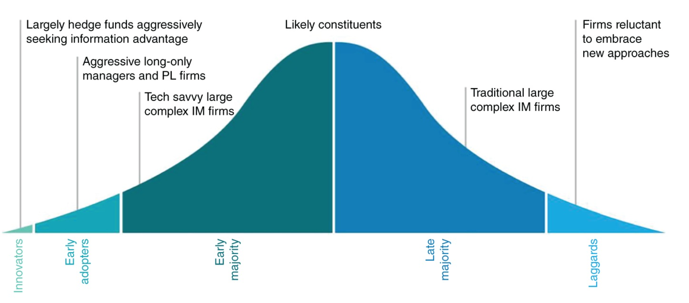
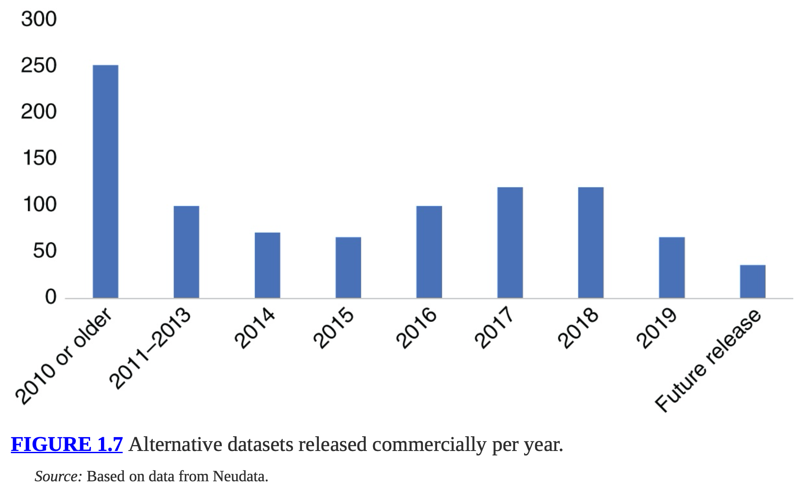
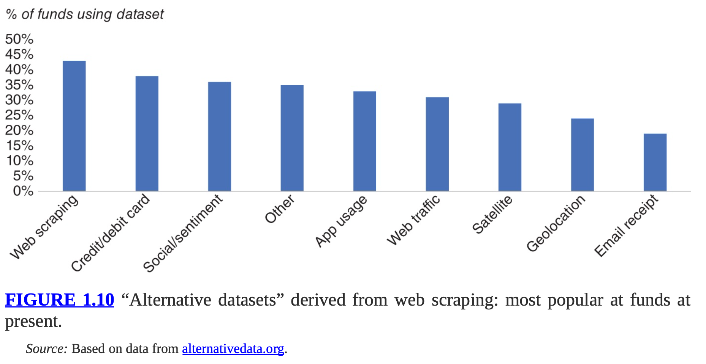

- [1 Alternative Data: The Lay of the Land](#1-alternative-data-the-lay-of-the-land)
  - [What is alt data](#what-is-alt-data)
  - [Why Alt Data](#why-alt-data)
  - [Who is using Alt Data](#who-is-using-alt-data)
  - [Capacity and Alt Data](#capacity-and-alt-data)
  - [A Score system to evaluate alt data](#a-score-system-to-evaluate-alt-data)
  - [Usage of Alt Dat](#usage-of-alt-dat)
- [2 The Value of Alt Data](#2-the-value-of-alt-data)
  - [Evaluating the alt data](#evaluating-the-alt-data)
- [3 Alt Data Risk and Challenges](#3-alt-data-risk-and-challenges)
- [4 Machine learning](#4-machine-learning)
- [Factor Investing](#factor-investing)
  - [1 Factor Model - CAPM](#1-factor-model---capm)
  - [Factor Model](#factor-model)
  - [Arbitrage Pricing Theory - APT](#arbitrage-pricing-theory---apt)
- [Examples of Alt Data](#examples-of-alt-data)
  - [Automotive Fundamental Data](#automotive-fundamental-data)
  - [Surveys and Crowdsourced Data](#surveys-and-crowdsourced-data)
  - [Purchasing Managers' Index](#purchasing-managers-index)
  - [Statellite image](#statellite-image)
  - [Location data](#location-data)
  - [Text, Web, News](#text-web-news)
  - [Investor Attention](#investor-attention)
  - [Consumer Transactions](#consumer-transactions)
  - [Government, Industrial, and Corporate Data](#government-industrial-and-corporate-data)
  - [Market Data](#market-data)
- [Alt Data in Private Market](#alt-data-in-private-market)

## 1 Alternative Data: The Lay of the Land

### What is alt data

Characteristics of alt data:

- less common
- more cost to collect
- outside financial market
- shorter history
- challenging to use

To produce a strategy from alternative data:

- algo
- processes
- technology
- cost-benefit analysis

Properties of data (including alt data):

- Technical
    - volume 🆙
    - variety 🆙
    - velocity 🆙
- Business
    - variability ⬆️
    - veracity ⬇️ , the confident of data
    - validity ⬇️ , accuracy and correctness
    - value ⬇️ , business impact

### Why Alt Data

Examples:

- Know GDP number in advance of release date
    - Use cases
        - Affect center back rates, hence fx and bond price
        - If a surprise can be used to trade short term reaction
    - How to know in advance?
        - PMI release monthly ( PMI indicators )  - **Alt Data**
- Estimate value of a company better
    - Transaction data of retails
    - capacity and utilization of plants
    - consumer loyalty to brands
    - greenhouse gas emissions
- Track prices of 5 million products online to understand inflation and price shocks
- Credit Card, App downloads, geo-location (how ?)[^1]
- Social media + search to predict earning[^2]
- Mobile foot traffic predict economy
- Satellite + ships predict mispriced security
- Web + Twitter = market moving event
- Twitter mood data = price move

### Who is using Alt Data

2010 the Twitter mood data can predict DOW index daily movement sparks the use of alt data.

Renaissance Technologies is using alt data even before the word alt data exist.

### Capacity and Alt Data

here is a square root relationship between the size of our orders and the market impact.

High capacity strategies:

- returns are less sensitive to increased transaction costs
- higher amounts of capital allocated without impacting return
- wide trading universe
- lower frequency
- lower sharpe ratio

Why capacity impact the use the alt data? We need to figure out if we leverage the
data, can we cover the cost of the data and make profit?

### A Score system to evaluate alt data

Reference the book section

### Usage of Alt Dat

## 2 The Value of Alt Data

What slows down the devalue of (alt) data:

- variety and multitude of data
- the way transform raw data to signals
- different horizon, styles, risk appetite

Market players who are quick to discover valuable datasets will have an edge, before these datasets become more commoditized. 

DaaS, Data as a Service, aka data marketplace.

__Data marketplace owner__, which is like brokers to stock buyer and sellers.
It is like a data catalogue and providing a unified API to deliver data 
( even unified symbology mappings ). A single point of billing is also continent.

For example: Quandl (with Nasdaq), Eagle Alpha, Qlik Data Marketplace, AWS public dataset.
Alt Data marketplace: FactSet.

### Evaluating the alt data

Out-of-sample backtesting.

## 3 Alt Data Risk and Challenges

- Legal risk
    - GDPR for example
- Mapping from different data sources
- Missing data
- Unstructured data
- Outliers
- Restatement/backfill?

## 4 Machine learning

## Factor Investing

### 1 Factor Model - CAPM

$$E[r_i] = r_f + \beta_{p,m}E[r_m - r_f]$$

where

- $r_i$ is the return of asset i
- $r_m$ is the return of market
- $r_f$ is the risk free rate
- $\beta_{p, m} = \rho_{p,m}\sigma_p/\sigma_m$
    - $\rho_{p,m}$ is the correlation of portfolio and market
    - $\sigma$ is the standard deviations of the portfolio and the market

### Factor Model

Marco, fundamental, and statistical assert pricing model.

### Arbitrage Pricing Theory - APT

Purely statistical model.

## Examples of Alt Data

### Automotive Fundamental Data

we have monthly reports for a variety of
sales/production-based metrics for each of 30 automotive companies in our dataset.

### Surveys and Crowdsourced Data

The company provides an alternative data-sourcing platform through which one can instantly connect with any individual or group of individuals globally and perform on-demand surveys.

### Purchasing Managers' Index

### Statellite image

### Location data

Using AIS data to understand flows of crude oil. 

### Text, Web, News

### Investor Attention

Bitly, collects the clicks contains word "payroll" to measure attention on real time!

Google Trend to measure market themes. Amen (2013) then discusses the creation of a Google Shock Sentiment index, specifically using the (inverted) searches associated with bankruptcy and unemployment.

Investopedia search data to measure investor anxiety.  Investor Anxiety Index . VIX is also a good factor.

### Consumer Transactions

Credit and debit card transactions data.

Consumer receipts

### Government, Industrial, and Corporate Data

Innovation measures to trade equities.

Insider Trading

Investor Day

Indication of Interest

### Market Data

PRI - Retail Price Improvement

## Alt Data in Private Market

---

[^1]: https://www.cbinsights.com/research/alternative-data-future-of-investing/
[^2]: https://www.bloomberg.com/news/articles/2017-03-07/acadian-to-use-microsoft-s-big-data-technology-to-help-make-bets?leadSource=uverify%20wall