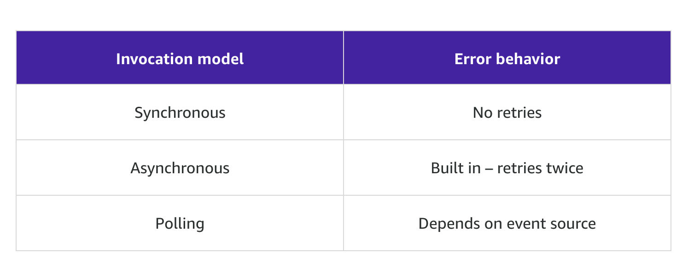

Serverless operation tasks:

- Build and deploy code
- secure and monitor instance

AWS serverless platform:

- Computation: Lambda
- Orchestration: Step Functions
- Storage: S3
- Data Store: DynamoDB
- Event Bus: EventBridge
- Inter-process Messaging: SNS, SQS
- API integration: API Gateway, AppSync
- Dev Tools: AWS serverless application model (SAM)

( Why Fargate is not listed here? )

## Lambda Foundation

### Invocation

Invocation models for lambda functions：

- Synchronous
    - invocation
    - service invocation
- Asynchronous
    - via event queue. when the client doesn't need an immediate response. 
    - via service integration: SNS, S3, EventBridge ( Push to lambda )
    - destination
- Polling
    - lambda poll services, such as Kinesis, SQS, DynamoDB Stream
    - event source mapping

Need to think about the retry logic:

### Performance Optimization

Ways to reduce latency:

- If you need predictable function start times for your workload, provisioned concurrency ensures the lowest possible latency. (< 100 ms to start)
- Store and reference dependencies locally
- Limit re-initialization of variables
- Add code to check and reuse the connections
- Use `/tmp` as transient cache
- Check that background processes have completed

### Permission

- IAM policy defines what action lambda can do
- Trust policy make sure target service allows lambda to act on
- Resource policy: A resource policy determines who is allowed in (who can initiate your function, such as Amazon S3), and it can be used to grant access across accounts. 
- IAM Execution Role: grant your function permissions to interact with other services. 

### Code up Lambda

- handler method
    - arguments
        - event object
        - context object (optional)
            - interact with execution env
            - request id
            - runtime
            - logging
    - Design best practices
        - Separate lambda and business logic code
        - Modular functions
        - Treat functions stateless
            - For state: DynamoDB, S3, ElastiCache
        - Minimal package size
    - Coding best practices
        - Using logging
        - Use the return coding. Every lambda function call has a return value
        - Use env var as config
        - NO recursive code!
        - Gather metrics with CloudWatch
        - Reuse execution context
            - Store dependency locally
            - Reuse existing connections
            - use `/tmp`

### Config Lambda

- Memory
- Timeout
- Concurrency
    - Unreserved
    - Reserved
    - Provisioned

### Dev and testing

A key difference in the developer workflow is how the code and the application are tested.

- Versioning, ie beta version
- Publish, snapshot copy
- Aliases, Prod, Test, Dev pointers

### Monitoring

- Invocation
- Duration
- Errors
- Throttles: The number of times that a process failed because of concurrency limits.
- IteratorAge

AWS X-Ray to visualize the components of your application

## Event-driven Architectures

- SQS -> Lambda ( Async connections, retry build it )
    - dead letter queue for failed to process events
    - client config the queue
    - lambda handle duplications of events
    - SQS ( no exact once delivery guarantee )
        - Standard
        - FIFO
- Step Functions
    - Error handling
    - Retry
    - State management
- Patterns for communicating status updates
    - Client polling: for long run job query
        - more latency
    - Webhooks with SNS
        - trusted
        - untrusted
    - WebSocket with AppSync
        - GraphQL (AppSync)
- Patterns for Serverless Data Processing
    - Kinesis Data Firehose
        - Producer -> Consumer
        - Scale by Shard
        - **Better for storing the stream not processing**
        - streams can only be associated with a single consumer, and the target must be Amazon S3, Amazon Redshift, Amazon OpenSearch Service, or Splunk.
    - Kinesis Data Stream
        - More consumers
        - Exactly-once delivery and order
    - SNS
        - Filter
        - Fan-out
        - Nested serverless
    - EventBridge
        - Events are observable not directed! Whereas Command are directed.
        - Event Bus will do the dispatch of events to correct consumer.
- Differences between messages and streams
    - Messages
        - entity is each message, and producing rate varies
        - consume then deleted
        - retry and dead-letter queue are there
    - Streaming
        - You look at the stream of messages together, and the stream is generally continuous.
        - Consumers must maintain a pointer.
        - A message is retried until it succeeds or expires. You must build error handling into your function to bypass a record.
- Failure management

( What's the differences between SQS and SNS? )

References: AWS serverless repository for more patterns

- SQS
    - Polling
    - Queue usually owned by consumers
- SNS
    - Topic
    - Message
    - Pub/Sub
    - High throughput
    - High fan-out ability
    - **A common pattern put a queue before each consumer to avoid missing data!**
- EventBridge
    - similar to SNS
    - **Integration with other service outside aws**. Otherwise maybe just use SNS.
    - Topic/EventBus
    - Events
    - Rules ( match rules and sending to targets )
    - Targets

### Design Serverless Application

- Migration patterns
    - Strangler pattern
    - Establish a bounded context and boundary
    - How does the application scale?
    - Do you have schedule-based tasks?
    - Do you have workers listening to a queue?
- Computation
    - Lambda
        - < 15min
        - Spiky, unpredictable workload
        - Real-time data processing
        - Unknown demand
        - light-weight, application focused, stateless computing
    - Fargate
        - lift and shift
        - long running process with larger package
        - predictable workload
        - More memory and CPU intensive
        - Docker runtime
- Storage
    - S3
        - data lakes
        - state store
        - Claim-check pattern
        - Filter data by Lambda
    - DynamoDB
        - kv store with ms latency
        - streaming and index
    - ElasticCache
        - realtime
        - in-memory store for sub-ms latency
- Application Architecture Patterns
    - serverless IT automation
    - web application and mobile apps

## Scaling serverless architectures

Build today with tomorrow in Mind.. ( hmm it depends on what is the project scope I think )

Scaling best practices:

- separate application and database
- identify and avoid heavy lifting
- monitor for percentile
- refactor as you go

Scaling considerations:

- timeout
- retry method
- throughput
- payload size

For API Gateway, add throttling can help to migrate backend failures.

For SQS:

- Number of message in batch (1 to 10)
- Number of default pollers ( 5 )
- Rate to increase lambda pollers ( 60 min )
- Number of batch lambda manage simultaneously ( to 1000 )
- Visibility timeout ( 0 second to 12 hours )
- retryies
- function timeout

For Lambda:

- Reuse execution env

For Database scaling:

## Security and Observability

- IAM is best for clients that are within your AWS environment or can otherwise retrieve IAM temporary credentials to access your environment.
- Amazon Cognito gives you a managed service that can support sign-in/sign-up capabilities or act as an identity provider (IdP) in a federated identity scenario.
- An API Gateway Lambda authorizer invokes a Lambda function to authenticate/validate a user against your existing IdP. This type of authorizer is useful for centralized authentication.
- Secret manager: A security expert wants to share sensitive information across multiple AWS accounts.
- System Manager parameter store: A team wants to share secrets across their Lambda functions in a single AWS account.
- AWS WAF - A security team wants to block traffic to their website that originates from Russia.

Observability

- Monitor
    - CloudWatch Metrics
- Trace
    - X-Ray: understand how your application and its underlying services are performing.
- Log
    - CloudWatch Logs
- Audit
    - AWS Config
    - CloudTrail

## Deploying Serverless Applications

- tool: SAM 
- configs
    - hardcode in lambda
    - env variables
    - parameters store
- deployment pipeline
    - lambda versions
    - lambda aliases
- deploy strategies
    - all at once
    - canary
    - linear

## API Gateways

- Webhooks API
- Rest API

